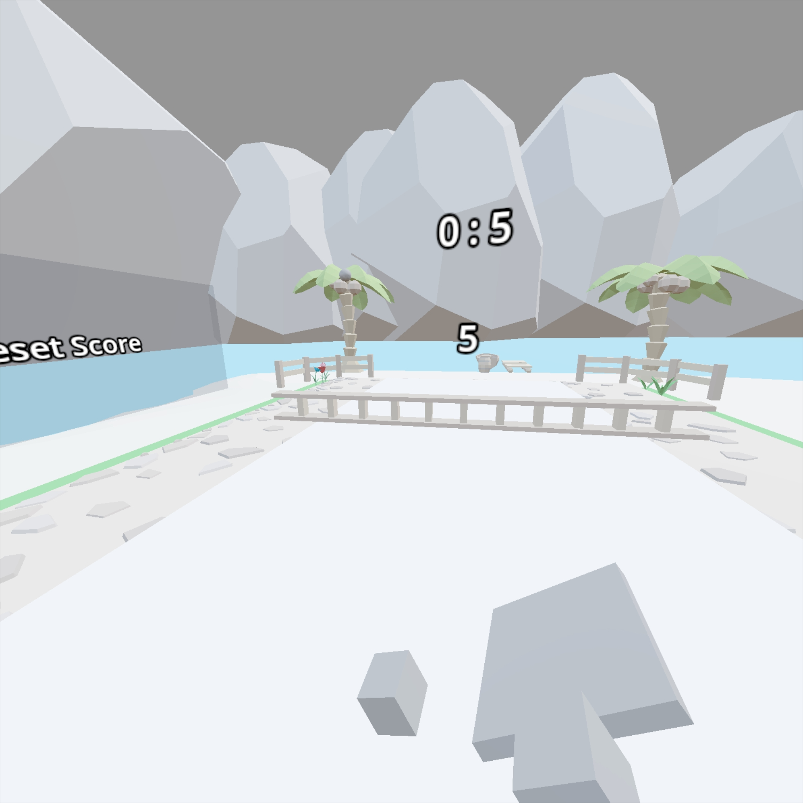
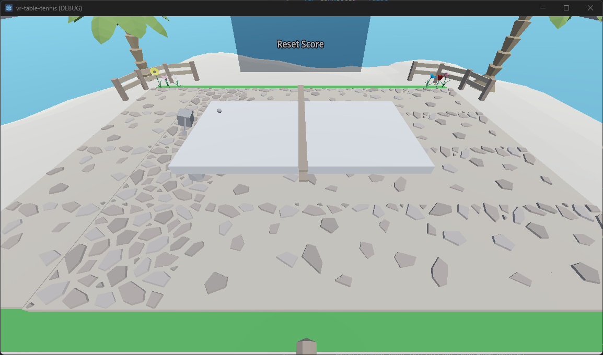

# vr-table-tennis
A simple VR game made with Godot 4.0. It was made for Pico 4. Not sure if it will work on other platforms.

Screenshot from Pico:


Screenshot from server:


# Modify the domain

This game is a multiplayer game. Domain or public IP needs to be set before running. Search for the string `YOUR_DOMAIN_OR_IP` in the project and replace it. Usually it is in `client.gd`.

# Run

## Start the server

```
$ /path/to/godot/bin/godot.windows.editor.x86_64.console.exe --path /path/to/vr-table-tennis --server
```

## Run the game

Two ways:
1. Export an apk and install it to Pico. Then run it on Pico.
2. Click the android icon on the right top of Godot project manager. It will automatically export/install/run the game on the device.


# Copyright Notice

The materials used in this project come from the following address, and the relevant rights belong to the original author. The MIT license only affects the game code.

- [Modular Village Pack](https://fertile-soil-productions.itch.io/modular-village-pack) - Keith at Fertile Soil Productions
- [Modular Terrain Pack](https://fertile-soil-productions.itch.io/modular-terrain-pack) - Keith at Fertile Soil Productions